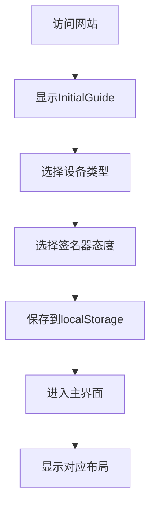
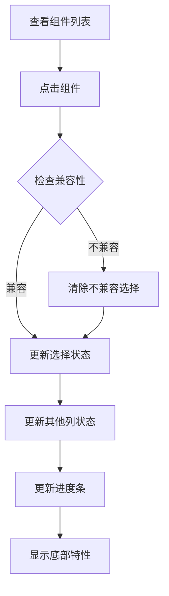
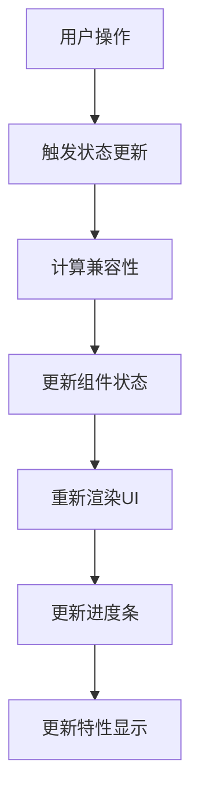

# 比特币自主托管交互网站 - 产品需求文档 (PRD)

## 1. 项目概述

### 1.1 项目目标
构建一个交互式的比特币自主托管教育和选择平台，帮助用户了解并选择适合的硬件签名器、软件钱包和区块链节点组合。

### 1.2 核心价值
- **教育性**：帮助用户理解比特币自主托管的重要性和实现方式
- **交互性**：通过可视化的组件选择和数据流展示，让复杂的技术概念变得易懂
- **实用性**：为用户提供基于偏好的个性化推荐和特性对比

### 1.3 技术栈
- **前端框架**：React 18.2.0 + TypeScript 4.9.0
- **构建工具**：Create React App (react-scripts 5.0.1)
- **样式方案**：纯CSS（无外部UI库）
- **状态管理**：React useState + useEffect
- **数据存储**：JSON文件 + LocalStorage（用户偏好）
- **数据加载**：异步fetch + 备用数据机制

## 2. 架构设计

### 2.1 项目结构
```
bitcoin-custody-website/
├── public/                    # 静态资源
│   ├── index.html              # HTML模板
│   └── custody-data.json       # 核心数据文件（JSON驱动）
├── src/
│   ├── components/           # 组件目录
│   │   ├── Header.tsx           # 顶部进度条和操作区
│   │   ├── InitialGuide.tsx     # 初始引导组件
│   │   ├── MainLayout.tsx       # 主布局组件
│   │   ├── ComponentColumn.tsx  # 组件列显示
│   │   └── FeaturesDisplay.tsx  # 特性显示组件
│   ├── App.tsx              # 主应用组件
│   ├── App.css              # 主样式文件
│   ├── types.ts             # TypeScript类型定义
│   ├── data.ts              # 备用数据配置
│   ├── dataLoader.ts        # 数据加载器
│   └── index.tsx            # 应用入口
├── build/                   # 构建输出目录
├── package.json             # 项目配置
├── tsconfig.json           # TypeScript配置
├── PRD-项目详细需求文档.md   # 项目文档
├── 进度条规则配置.md         # 进度条规则文档
└── README.md               # 项目说明
```

### 2.2 组件层级关系
```
App
├── InitialGuide (条件渲染)
├── Header
└── MainLayout
    ├── ComponentColumn (硬件签名器) [条件渲染]
    ├── DataFlow (数据流箭头)
    ├── ComponentColumn (软件钱包)
    ├── DataFlow (数据流箭头)
    └── ComponentColumn (区块链节点)
└── BottomFeatures (底部特性框)
```

## 3. 核心功能模块

### 3.1 用户引导系统 (InitialGuide)

#### 3.1.1 功能描述
- 两步引导流程：设备类型选择 → 硬件签名器态度选择
- 全屏模态形式，引导用户完成初始设置

#### 3.1.2 数据流
```typescript
interface UserPreference {
  deviceType: 'mobile' | 'desktop';           // 设备类型
  signerWillingness: 'no-signer' | 'with-signer';  // 硬件签名器使用意愿
}
```

#### 3.1.3 业务规则
- 设备类型影响界面布局响应式适配
- 签名器意愿决定是否显示硬件签名器列（三列vs两列布局）
- 选择结果存储在localStorage，下次访问时自动加载

### 3.2 进度追踪系统 (Header)

#### 3.2.1 功能描述
- 实时计算用户选择完成度百分比
- 动态颜色变化和溢出效果
- 重置功能和模式切换

#### 3.2.2 进度计算逻辑（基于用户配置的规则）
```typescript
const getCompletionPercentage = (): number => {
  if (!state.userPreference) return 0;
  
  const hasWallet = state.selectedWallet !== null;
  const hasSigner = state.selectedSigners.length > 0;
  const hasNode = state.selectedNode !== null;
  const hasNoneSigner = state.selectedSigners.includes('none');
  const hasHardwareSigner = state.selectedSigners.some(id => id !== 'none');
  
  // 基于进度条规则配置文档的规则
  if (hasHardwareSigner && hasWallet && hasNode) return 120;  // 完整配置+庆祝
  if (hasHardwareSigner && hasWallet) return 100;            // 硬件+钱包
  if (hasNoneSigner && hasWallet && hasNode) return 80;      // 软件+钱包+节点
  if (hasNoneSigner && hasWallet) return 60;                 // 软件+钱包
  if (hasHardwareSigner && !hasWallet) return 50;           // 仅硬件签名器
  return 0;                                                  // 空状态
};
```

#### 3.2.3 视觉反馈
- 0%：黄色 (#fbbf24) - 空状态
- 50%：浅绿色 (#10b981) - 仅选择硬件签名器
- 60%：深绿色 (#059669) - "不使用签名器" + 软件钱包
- 80%：更深绿色 (#16a34a) - "不使用签名器" + 软件钱包 + 节点
- 100%：深绿色 (#059669) - 硬件签名器 + 软件钱包
- 120%：蓝色 (#3b82f6) + 🎉庆祝动画（3秒闪烁）

### 3.3 组件选择系统 (ComponentColumn)

#### 3.3.1 数据模型
```typescript
// 硬件签名器（包括"不使用签名器"选项）
interface HardwareSigner {
  id: string;                    // 唯一标识
  name: string;                  // 显示名称
  logo: string;                  // emoji图标
  features: Feature[];           // 特性列表
  compatibleWallets: string[];   // 兼容钱包ID列表
  dataTransferMethods: string[]; // 数据传输方式
}

// 软件钱包（包括设备平台支持）
interface SoftwareWallet {
  id: string;
  name: string;
  logo: string;
  features: Feature[];
  compatibleSigners: string[];   // 兼容签名器ID列表
  compatibleNodes: string[];     // 兼容节点ID列表
  supportedPlatforms: string[];  // 支持的设备平台
}

// 区块链节点
interface BlockchainNode {
  id: string;
  name: string;
  logo: string;
  features: Feature[];
  compatibleWallets: string[];   // 兼容钱包ID列表
}

// 特性定义
interface Feature {
  type: 'positive' | 'negative' | 'warning';  // 特性类型
  text: string;                                // 特性描述
}

// 传输方式映射（新增）
interface TransferMethods {
  [signerId: string]: {
    [walletId: string]: string[];  // 传输方式列表
  };
}
```

#### 3.3.2 状态管理
```typescript
type ComponentState = 'inactive' | 'breathing' | 'active';

// 状态计算逻辑
- inactive：不可选择（灰色、降透明度）
- breathing：推荐选择（呼吸动画、绿色边框）
- active：已选中（绿色背景、高亮）
```

#### 3.3.3 兼容性逻辑
- **向前兼容**：选择签名器后，显示兼容的钱包（breathing状态）
- **向后兼容**：选择钱包后，显示兼容的节点（breathing状态）
- **互斥选择**：同列中选择新项目会取消其他选择
- **依赖清除**：选择不兼容项目会清除下游选择

### 3.4 数据流可视化系统

#### 3.4.1 功能描述
- 显示组件间的数据传输关系
- 动态虚线动画效果
- 响应式布局适配

#### 3.4.2 数据流方向
```
硬件签名器 ←→ 软件钱包 ←→ 区块链节点
    ↓           ↓           ↓
 签名和公钥   待签名的交易   余额信息
 待签名交易   地址信息      地址；已签名交易
```

#### 3.4.3 传输方式标签系统
- **动态显示**：仅当同时选中硬件签名器和软件钱包时显示
- **颜色分类**：
  - SD卡：浅蓝色底 (#bfdbfe)
  - 二维码：粉红色底 (#fce7f3)
  - USB：浅绿色底 (#bbf7d0)
  - 蓝牙：紫色底 (#e0e7ff)
  - NFC：橙色底 (#fed7aa)
- **布局**：固定宽度箭头区域（移动端180px，桌面端220px）
- **去重逻辑**：自动去除重复的传输方式标签

#### 3.4.4 视觉实现
- **虚线连接线**：CSS linear-gradient创建，深绿色(#059669)和透明色交替
- **流动动画**：background-position动画，2秒循环
  - 桌面端：水平方向从左到右流动
  - 移动端：垂直方向从上到下流动
- **箭头尖端**：CSS伪元素border实现
  - 右向箭头：border-left: 20px solid #059669
  - 左向箭头：border-right: 20px solid #059669
- **响应式**：桌面水平、移动垂直
- **双向数据流**：硬件签名器和软件钱包之间显示两个方向的箭头

### 3.5 特性展示系统

#### 3.5.1 布局策略
- **底部固定定位**：使用CSS Grid布局，与上方组件列垂直对齐
- **动态对齐**：三列模式和两列模式自动适配
- **响应式设计**：移动端垂直堆叠，桌面端水平对齐

#### 3.5.2 对齐算法
```typescript
// 三列模式位置计算
const threeColumnLayout = {
  gridTemplateColumns: '1fr auto 1fr auto 1fr',
  gap: '60px',
  hardwareSignerColumn: 1,
  firstDataFlow: 2,
  softwareWalletColumn: 3,
  secondDataFlow: 4,
  blockchainNodeColumn: 5
};

// 两列模式位置计算
const twoColumnLayout = {
  gridTemplateColumns: '1fr auto 1fr',
  gap: '60px',
  softwareWalletColumn: 1,
  dataFlow: 2,
  blockchainNodeColumn: 3
};
```

#### 3.5.3 特性分类显示
- **正面特性** (positive)：绿色背景 (#f0fdf4)，✅图标
- **负面特性** (negative)：红色背景 (#fef2f2)，❌图标  
- **警告特性** (warning)：橙色背景 (#fffbeb)，⚠️图标

## 4. 数据配置

### 4.1 硬件签名器数据
```typescript
// 当前包含6个选项（包括"不使用签名器"）
[
  { id: 'trezor', name: 'Trezor', logo: '🔒' },
  { id: 'coldcard', name: 'ColdCard', logo: '❄️' },
  { id: 'keystone', name: 'Keystone', logo: '📱' },
  { id: 'ledger', name: 'Ledger', logo: '💳' },
  { id: 'bitbox', name: 'BitBox02', logo: '📦' },
  { id: 'none', name: '不使用签名器', logo: '🚫' }  // 新增选项
]
```

### 4.2 软件钱包数据
```typescript
// 当前包含5个主流软件钱包
[
  { id: 'sparrow', name: 'Sparrow Wallet', logo: '🐦' },
  { id: 'electrum', name: 'Electrum', logo: '⚡' },
  { id: 'bluewallet', name: 'BlueWallet', logo: '💙' },
  { id: 'specter', name: 'Specter Desktop', logo: '👻' },
  { id: 'bitcoin-core-wallet', name: 'Bitcoin Core Wallet', logo: '₿' }
]
```

### 4.3 区块链节点数据
```typescript
// 当前包含3个节点选项（增加了更多详细信息）
[
  { 
    id: 'bitcoin-core', 
    name: 'Bitcoin Core', 
    logo: '🟠',
    features: [
      { type: 'positive', text: '完整验证所有交易' },
      { type: 'positive', text: '最高安全性' },
      { type: 'negative', text: '需要大量存储空间（500GB+）' },
      { type: 'warning', text: '初始同步时间长（数天）' }
    ]
  },
  { 
    id: 'electrum-server', 
    name: 'Electrum Server', 
    logo: '🔌',
    features: [
      { type: 'positive', text: '快速同步' },
      { type: 'positive', text: '隐私友好' },
      { type: 'negative', text: '依赖Bitcoin Core' },
      { type: 'warning', text: '需要额外设置' }
    ]
  },
  { 
    id: 'blockstream', 
    name: 'Blockstream Green', 
    logo: '🌿',
    features: [
      { type: 'positive', text: '免费使用' },
      { type: 'positive', text: '快速同步' },
      { type: 'negative', text: '依赖第三方' },
      { type: 'warning', text: '隐私性较低' }
    ]
  }
]
```

### 4.4 传输方式数据（新增）
```typescript
// 传输方式映射关系
transferMethods: {
  'trezor': {
    'sparrow': ['USB'],
    'electrum': ['USB'],
    'bluewallet': ['USB']
  },
  'coldcard': {
    'sparrow': ['SD卡'],
    'electrum': ['SD卡'],
    'specter': ['SD卡']
  },
  'keystone': {
    'sparrow': ['二维码', 'USB'],
    'bluewallet': ['二维码']
  },
  'ledger': {
    'sparrow': ['USB'],
    'electrum': ['USB', '蓝牙']
  },
  'bitbox': {
    'sparrow': ['USB'],
    'electrum': ['USB']
  }
}

// 支持的传输方式类型
支持的传输方式: ['SD卡', '二维码', 'USB', '蓝牙', 'NFC']
注意: PSBT不是传输方式，是数据格式，已从映射中移除
```

### 5.1 首次访问流程


### 5.2 组件选择流程


### 5.3 状态管理流程


## 6. 技术实现细节

### 6.1 状态管理架构
```typescript
interface AppState {
  selectedSigners: string[];        // 选中的签名器ID列表
  selectedWallet: string | null;    // 选中的钱包ID
  selectedNode: string | null;      // 选中的节点ID
  userPreference: UserPreference | null;  // 用户偏好
  showGuide: boolean;               // 是否显示引导
  custodyData: CustodyData | null;  // 动态加载的数据
  isLoading: boolean;               // 数据加载状态
}
```

### 6.2 核心计算函数
```typescript
// 组件状态计算
getComponentState(componentId: string, type: 'signer' | 'wallet' | 'node'): ComponentState

// 组件点击处理
handleComponentClick(componentId: string, type: 'signer' | 'wallet' | 'node'): void

// 完成度计算（基于进度条规则配置）
getCompletionPercentage(): number

// 进度条颜色计算
getProgressColor(percentage: number): string

// 传输方式获取
getTransferMethods(): string[]

// 传输方式CSS类名映射
getTransferMethodClass(method: string): string

// 数据异步加载
loadCustodyData(): Promise<CustodyData>
```

### 6.3 响应式设计策略
- **断点设置**：768px（平板）、480px（手机）
- **布局切换**：Grid → Flex → Stack
- **组件适配**：水平箭头 → 垂直箭头
- **间距调整**：桌面端60px → 移动端40px

### 6.4 性能优化措施
- **useEffect依赖数组优化**：避免不必要的重渲染
- **JSON数据异步加载**：支持大数据量，提升首屏加载速度
- **备用数据机制**：网络失败时使用本地数据，确保可用性
- **条件渲染**：传输标签仅在需要时显示，减少DOM节点
- **CSS动画优化**：使用transform和opacity，启用硬件加速
- **响应式布局**：CSS Grid和Flexbox，减少JavaScript计算

## 9. 样式设计规范

### 7.1 色彩体系
```css
/* 主色调 */
--primary-green: #059669;      /* 深绿色 - 主要状态 */
--light-green: #10b981;        /* 浅绿色 - 次要状态 */
--warning-orange: #fbbf24;     /* 警告橙色 */
--error-red: #dc2626;          /* 错误红色 */
--accent-blue: #3b82f6;        /* 强调蓝色 */

/* 中性色 */
--gray-50: #f8fafc;           /* 背景色 */
--gray-100: #f1f5f9;          /* 浅灰背景 */
--gray-200: #e2e8f0;          /* 边框色 */
--gray-600: #4b5563;          /* 正文色 */
--gray-800: #1a202c;          /* 标题色 */
```

### 7.2 字体规范
```css
/* 字体大小 */
--text-xs: 0.75rem;   /* 12px - 小标签 */
--text-sm: 0.875rem;  /* 14px - 按钮文字 */
--text-base: 1rem;    /* 16px - 正文 */
--text-lg: 1.125rem;  /* 18px - 副标题 */
--text-xl: 1.25rem;   /* 20px - 小标题 */
--text-2xl: 1.5rem;   /* 24px - 大标题 */

/* 字重 */
--font-normal: 400;
--font-medium: 500;
--font-semibold: 600;
--font-bold: 700;
```

### 7.3 间距体系
```css
/* 间距单位 */
--space-1: 0.25rem;   /* 4px */
--space-2: 0.5rem;    /* 8px */
--space-3: 0.75rem;   /* 12px */
--space-4: 1rem;      /* 16px */
--space-5: 1.25rem;   /* 20px */
--space-6: 1.5rem;    /* 24px */
--space-8: 2rem;      /* 32px */
--space-10: 2.5rem;   /* 40px */
--space-12: 3rem;     /* 48px */
--space-15: 3.75rem;  /* 60px */
```

### 7.4 圆角和阴影
```css
/* 圆角 */
--radius-sm: 0.5rem;    /* 8px - 小组件 */
--radius-md: 0.75rem;   /* 12px - 中等组件 */
--radius-lg: 1rem;      /* 16px - 大组件 */
--radius-xl: 1.25rem;   /* 20px - 特大组件 */

/* 阴影 */
--shadow-sm: 0 2px 8px rgba(0, 0, 0, 0.1);
--shadow-md: 0 4px 12px rgba(0, 0, 0, 0.1);
--shadow-lg: 0 8px 25px rgba(0, 0, 0, 0.15);
--shadow-glow: 0 0 20px rgba(16, 185, 129, 0.3);
```

### 9.5 传输方式颜色系统（新增）
```css
/* 传输方式专属颜色 */
.transfer-tag.sd-card {
  background: #bfdbfe; /* 浅蓝色 - SD卡 */
  color: #1e40af;
}

.transfer-tag.qr-code {
  background: #fce7f3; /* 粉红色 - 二维码 */
  color: #be185d;
}

.transfer-tag.usb {
  background: #bbf7d0; /* 浅绿色 - USB */
  color: #065f46;
}

.transfer-tag.bluetooth {
  background: #e0e7ff; /* 紫色 - 蓝牙 */
  color: #3730a3;
}

.transfer-tag.nfc {
  background: #fed7aa; /* 橙色 - NFC */
  color: #9a3412;
}

/* 动态效果 */
.transfer-tag:hover {
  transform: scale(1.05);
  box-shadow: 0 3px 8px rgba(5, 150, 105, 0.35);
}
```

### 9.6 进度条颜色系统（新增）
```css
/* 进度条颜色映射 */
--progress-0: #fbbf24;    /* 黄色 - 空状态 */
--progress-50: #10b981;   /* 浅绿色 - 仅硬件签名器 */
--progress-60: #059669;   /* 深绿色 - 软件钱包 */
--progress-80: #16a34a;   /* 更深绿色 - 软件+节点 */
--progress-100: #059669;  /* 深绿色 - 硬件+软件 */
--progress-120: #3b82f6;  /* 蓝色 - 完整配置+庆祝 */

/* 庆祝动画效果 */
@keyframes celebration {
  0%, 100% { opacity: 1; transform: scale(1); }
  50% { opacity: 0.7; transform: scale(1.2); }
}

.celebration-emoji {
  animation: celebration 0.5s ease-in-out 6 alternate;
}
```

### 8.1 数据扩展
- **新增硬件签名器**：在custody-data.json中添加新对象，系统自动识别
- **新增软件钱包**：更新compatibleSigners和compatibleNodes关系
- **新增区块链节点**：配置compatibleWallets关系
- **新增传输方式**：在transferMethods中配置新的传输方式映射
- **新增特性类型**：扩展Feature接口，添加新的type值
- **颜色主题扩展**：在CSS中添加新的传输方式颜色类

### 8.2 功能扩展点
- **多签模式**：当前预留接口，可扩展多重签名功能
- **高级筛选**：可添加按特性、价格、安全级别筛选
- **详细对比**：可扩展组件详细信息页面
- **用户评价**：可添加社区评分和评论系统
- **数据源扩展**：支持多种数据源（API、本地文件、CDN）
- **主题系统**：可扩展暗色主题和自定义颜色方案

### 8.3 数据管理优化
- **JSON数据驱动**：所有组件数据集中在custody-data.json中管理
- **异步加载机制**：支持大数据量，避免阻塞首屏渲染
- **备用数据策略**：网络失败时使用本地备用数据
- **热更新支持**：修改JSON数据后无需重新编译
- **数据验证**：TypeScript类型检查确保数据格式正确性

## 11. 技术架构升级详解（新增）

### 11.1 JSON数据驱动架构
- **数据集中管理**：所有组件数据统一存储在 `public/custody-data.json`
- **热更新支持**：修改JSON文件后无需重新编译，刷新页面即可生效
- **类型安全**：TypeScript接口定义确保数据结构正确性
- **扩展性强**：新增组件只需在JSON中添加数据，无需修改代码

### 11.2 进度条规则系统
- **配置文档驱动**：基于 `进度条规则配置.md` 文档实现具体的百分比规则
- **多种状态支持**：0%、50%、60%、80%、100%、120% 六种进度状态
- **动态颜色系统**：不同进度对应不同颜色和视觉效果
- **庆祝动画**：120%进度触发🎉emoji闪烁3秒动画效果

### 11.3 数据流可视化系统
- **双向数据流**：硬件签名器↔软件钱包，展示完整的数据交互过程
- **传输方式标签**：动态显示SD卡、二维码、USB、蓝牙、NFC五种传输方式
- **颜色分类系统**：每种传输方式对应专属颜色主题
- **固定宽度布局**：箭头区域采用固定宽度（移动端180px，桌面端220px）
- **流动动画效果**：CSS线性渐变创建的虚线流动动画

### 11.4 响应式设计优化
- **断点策略**：768px（平板分界）、480px（手机分界）
- **布局切换**：桌面端Grid布局 → 移动端Flex垂直布局
- **动画适配**：桌面端水平流动 → 移动端垂直流动
- **交互优化**：移动端增强触摸体验，桌面端优化鼠标悬停效果

## 12. 部署和维护升级（新增）

### 9.1 构建配置
```bash
# 开发环境
npm start                 # 启动开发服务器

# 生产环境
npm run build            # 构建生产版本
npm run test             # 运行测试
```

### 9.2 部署方式
1. **静态托管**：build目录可直接部署到任何静态托管服务
2. **CDN分发**：支持CDN加速，提升全球访问速度
3. **Docker容器**：可容器化部署，便于运维管理

### 9.3 监控指标
- **性能指标**：首屏渲染时间、交互响应时间
- **用户行为**：组件选择路径、完成率统计
- **技术指标**：错误率、内存使用情况

## 10. 未来发展方向

### 10.1 短期优化（1-3个月）
- **传输方式扩展**：添加更多传输方式和颜色主题
- **进度条规则优化**：支持更复杂的进度计算逻辑
- **移动端交互优化**：改进触摸体验和手势操作
- **数据管理界面**：提供可视化的数据编辑工具

### 10.2 中期发展（3-6个月）
- **多签模式**：支持多重签名配置和可视化
- **智能推荐**：基于用户偏好的个性化推荐
- **社区功能**：用户评价、讨论和经验分享
- **多语言支持**：国际化和本地化

### 10.3 长期愿景（6-12个月）
- **实际集成**：与真实钱包和节点的API集成
- **教育模块**：交互式教程和最佳实践指南
- **生态对接**：与硬件厂商和软件开发商合作
- **企业版本**：面向机构的高级功能和定制化

---

## 附录

### A. 技术依赖清单
```json
{
  "dependencies": {
    "react": "^18.2.0",
    "react-dom": "^18.2.0",
    "typescript": "^4.9.0"
  },
  "devDependencies": {
    "react-scripts": "5.0.1",
    "@types/react": "^18.2.0",
    "@types/react-dom": "^18.2.0"
  }
}
```

### B. 浏览器兼容性
- Chrome 88+
- Firefox 78+
- Safari 14+
- Edge 88+

### C. 性能基准
- 首屏渲染：< 2秒
- 交互响应：< 100ms
- 包大小：< 500KB (gzipped)
- 内存使用：< 50MB

---

**文档版本**: v2.0
**最后更新**: 2025年1月
**维护人员**: 产品开发团队
**项目状态**: 生产就绪
**技术架构**: JSON数据驱动 + React组件化