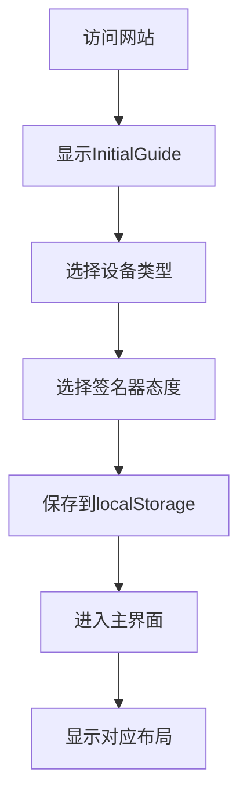
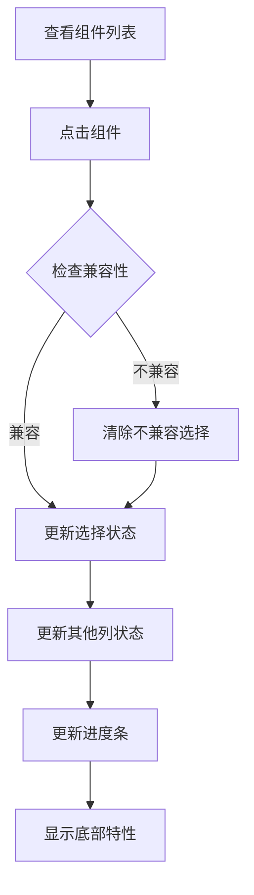
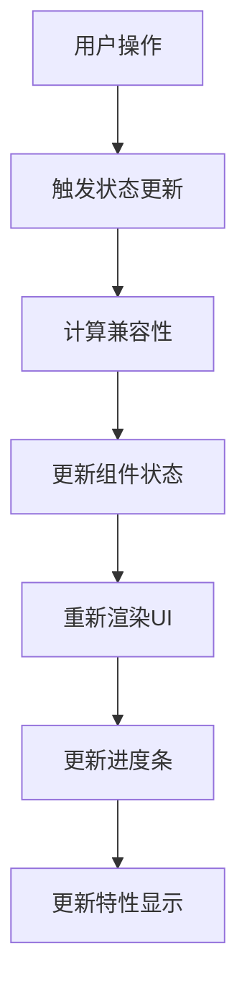

# 比特币自主托管交互网站 - 产品需求文档 (PRD)

## 1. 项目概述

### 1.1 项目目标
构建一个交互式的比特币自主托管教育和选择平台，帮助用户了解并选择适合的硬件签名器、软件钱包和区块链节点组合。

### 1.2 核心价值
- **教育性**：帮助用户理解比特币自主托管的重要性和实现方式
- **交互性**：通过可视化的组件选择和数据流展示，让复杂的技术概念变得易懂
- **实用性**：为用户提供基于偏好的个性化推荐和特性对比

### 1.3 技术栈
- **前端框架**：React 18.2.0 + TypeScript 4.9.0
- **构建工具**：Create React App (react-scripts 5.0.1)
- **样式方案**：纯CSS（无外部UI库）
- **状态管理**：React useState + useEffect
- **数据存储**：本地数据 + LocalStorage

## 2. 架构设计

### 2.1 项目结构
```
bitcoin-custody-website/
├── public/                    # 静态资源
├── src/
│   ├── components/           # 组件目录
│   │   ├── Header.tsx           # 顶部进度条和操作区
│   │   ├── InitialGuide.tsx     # 初始引导组件
│   │   ├── MainLayout.tsx       # 主布局组件
│   │   ├── ComponentColumn.tsx  # 组件列显示
│   │   └── FeaturesDisplay.tsx  # 特性显示（备用）
│   ├── App.tsx              # 主应用组件
│   ├── App.css              # 主样式文件
│   ├── types.ts             # TypeScript类型定义
│   ├── data.ts              # 静态数据配置
│   └── index.tsx            # 应用入口
├── package.json             # 项目配置
└── tsconfig.json           # TypeScript配置
```

### 2.2 组件层级关系
```
App
├── InitialGuide (条件渲染)
├── Header
└── MainLayout
    ├── ComponentColumn (硬件签名器) [条件渲染]
    ├── DataFlow (数据流箭头)
    ├── ComponentColumn (软件钱包)
    ├── DataFlow (数据流箭头)
    └── ComponentColumn (区块链节点)
└── BottomFeatures (底部特性框)
```

## 3. 核心功能模块

### 3.1 用户引导系统 (InitialGuide)

#### 3.1.1 功能描述
- 两步引导流程：设备类型选择 → 硬件签名器态度选择
- 全屏模态形式，引导用户完成初始设置

#### 3.1.2 数据流
```typescript
interface UserPreference {
  deviceType: 'mobile' | 'desktop';           // 设备类型
  signerWillingness: 'no-signer' | 'with-signer';  // 硬件签名器使用意愿
}
```

#### 3.1.3 业务规则
- 设备类型影响界面布局响应式适配
- 签名器意愿决定是否显示硬件签名器列（三列vs两列布局）
- 选择结果存储在localStorage，下次访问时自动加载

### 3.2 进度追踪系统 (Header)

#### 3.2.1 功能描述
- 实时计算用户选择完成度百分比
- 动态颜色变化和溢出效果
- 重置功能和模式切换

#### 3.2.2 进度计算逻辑
```typescript
// 三列模式（with-signer）
if (hasWallet && hasSigner) {
  return hasNode ? 120 : 100;  // 100%基线 + 20%奖励
} else if (hasWallet || hasSigner) {
  return 50;                   // 选择任一个达50%
}

// 两列模式（no-signer）
if (hasWallet) {
  return hasNode ? 120 : 100;  // 直接100%
}
```

#### 3.2.3 视觉反馈
- 0%：黄色 (#fbbf24)
- 50%：浅绿色 (#10b981)
- 100%：深绿色 (#059669)
- 120%：蓝色 (#3b82f6) + 发光动画

### 3.3 组件选择系统 (ComponentColumn)

#### 3.3.1 数据模型
```typescript
// 硬件签名器
interface HardwareSigner {
  id: string;                    // 唯一标识
  name: string;                  // 显示名称
  logo: string;                  // emoji图标
  features: Feature[];           // 特性列表
  compatibleWallets: string[];   // 兼容钱包ID列表
  dataTransferMethods: string[]; // 数据传输方式
}

// 软件钱包
interface SoftwareWallet {
  id: string;
  name: string;
  logo: string;
  features: Feature[];
  compatibleSigners: string[];   // 兼容签名器ID列表
  compatibleNodes: string[];     // 兼容节点ID列表
}

// 区块链节点
interface BlockchainNode {
  id: string;
  name: string;
  logo: string;
  features: Feature[];
  compatibleWallets: string[];   // 兼容钱包ID列表
}

// 特性定义
interface Feature {
  type: 'positive' | 'negative' | 'warning';  // 特性类型
  text: string;                                // 特性描述
}
```

#### 3.3.2 状态管理
```typescript
type ComponentState = 'inactive' | 'breathing' | 'active';

// 状态计算逻辑
- inactive：不可选择（灰色、降透明度）
- breathing：推荐选择（呼吸动画、绿色边框）
- active：已选中（绿色背景、高亮）
```

#### 3.3.3 兼容性逻辑
- **向前兼容**：选择签名器后，显示兼容的钱包（breathing状态）
- **向后兼容**：选择钱包后，显示兼容的节点（breathing状态）
- **互斥选择**：同列中选择新项目会取消其他选择
- **依赖清除**：选择不兼容项目会清除下游选择

### 3.4 数据流可视化系统

#### 3.4.1 功能描述
- 显示组件间的数据传输关系
- 动态虚线动画效果
- 响应式布局适配

#### 3.4.2 数据流方向
```
硬件签名器 ←→ 软件钱包 ← 区块链节点
    ↓           ↓         ↓
 签名&公钥   交易构建   区块链数据
 待签名交易   UTXO管理   交易广播
```

#### 3.4.3 视觉实现
- 虚线连接线：CSS linear-gradient创建
- 流动动画：background-position动画
- 箭头尖端：CSS伪元素border实现
- 响应式：桌面水平、移动垂直

### 3.5 特性展示系统

#### 3.5.1 布局策略
- **底部固定定位**：position: fixed, bottom: 20px
- **动态对齐**：JavaScript计算上方组件列的位置
- **CSS变量驱动**：--signer-left, --wallet-left, --node-right

#### 3.5.2 对齐算法
```typescript
// 三列模式位置计算
const columnWidth = (containerWidth - 120) / 3;  // 减去gap间距
const signerCenter = containerLeft + columnWidth / 2;
const walletCenter = containerLeft + columnWidth + 60 + columnWidth / 2;
const nodeCenter = containerLeft + (columnWidth + 60) * 2 + columnWidth / 2;

// 两列模式位置计算
const columnWidth = (containerWidth - 60) / 2;
const walletCenter = containerLeft + columnWidth / 2;
const nodeCenter = containerLeft + columnWidth + 60 + columnWidth / 2;
```

#### 3.5.3 特性分类显示
- **正面特性** (positive)：绿色背景 (#f0fdf4)，✅图标
- **负面特性** (negative)：红色背景 (#fef2f2)，❌图标  
- **警告特性** (warning)：橙色背景 (#fffbeb)，⚠️图标

## 4. 数据配置

### 4.1 硬件签名器数据
```typescript
// 当前包含5个主流硬件签名器
[
  { id: 'trezor', name: 'Trezor', logo: '🔒' },
  { id: 'coldcard', name: 'ColdCard', logo: '❄️' },
  { id: 'keystone', name: 'Keystone', logo: '📱' },
  { id: 'ledger', name: 'Ledger', logo: '💳' },
  { id: 'bitbox', name: 'BitBox02', logo: '📦' }
]
```

### 4.2 软件钱包数据
```typescript
// 当前包含5个主流软件钱包
[
  { id: 'sparrow', name: 'Sparrow Wallet', logo: '🐦' },
  { id: 'electrum', name: 'Electrum', logo: '⚡' },
  { id: 'bluewallet', name: 'BlueWallet', logo: '💙' },
  { id: 'specter', name: 'Specter Desktop', logo: '👻' },
  { id: 'bitcoin-core-wallet', name: 'Bitcoin Core Wallet', logo: '₿' }
]
```

### 4.3 区块链节点数据
```typescript
// 当前包含3个节点选项
[
  { id: 'bitcoin-core', name: 'Bitcoin Core', logo: '🟠' },
  { id: 'electrum-server', name: 'Electrum Server', logo: '🔌' },
  { id: 'blockstream', name: 'Blockstream Green', logo: '🌿' }
]
```

## 5. 用户交互流程

### 5.1 首次访问流程


### 5.2 组件选择流程


### 5.3 状态管理流程


## 6. 技术实现细节

### 6.1 状态管理架构
```typescript
interface AppState {
  selectedSigners: string[];        // 选中的签名器ID列表
  selectedWallet: string | null;    // 选中的钱包ID
  selectedNode: string | null;      // 选中的节点ID
  userPreference: UserPreference | null;  // 用户偏好
  showGuide: boolean;               // 是否显示引导
}
```

### 6.2 核心计算函数
```typescript
// 组件状态计算
getComponentState(componentId: string, type: 'signer' | 'wallet' | 'node'): ComponentState

// 组件点击处理
handleComponentClick(componentId: string, type: 'signer' | 'wallet' | 'node'): void

// 完成度计算
getCompletionPercentage(): number

// 位置对齐计算
updateFeatureBoxPositions(): void
```

### 6.3 响应式设计策略
- **断点设置**：768px（平板）、480px（手机）
- **布局切换**：Grid → Flex → Stack
- **组件适配**：水平箭头 → 垂直箭头
- **间距调整**：桌面端60px → 移动端40px

### 6.4 性能优化措施
- useEffect依赖数组优化，避免不必要的重渲染
- CSS变量动态更新，减少DOM操作
- 事件监听器正确清理，防止内存泄漏
- 条件渲染减少DOM节点数量

## 7. 样式设计规范

### 7.1 色彩体系
```css
/* 主色调 */
--primary-green: #059669;      /* 深绿色 - 主要状态 */
--light-green: #10b981;        /* 浅绿色 - 次要状态 */
--warning-orange: #fbbf24;     /* 警告橙色 */
--error-red: #dc2626;          /* 错误红色 */
--accent-blue: #3b82f6;        /* 强调蓝色 */

/* 中性色 */
--gray-50: #f8fafc;           /* 背景色 */
--gray-100: #f1f5f9;          /* 浅灰背景 */
--gray-200: #e2e8f0;          /* 边框色 */
--gray-600: #4b5563;          /* 正文色 */
--gray-800: #1a202c;          /* 标题色 */
```

### 7.2 字体规范
```css
/* 字体大小 */
--text-xs: 0.75rem;   /* 12px - 小标签 */
--text-sm: 0.875rem;  /* 14px - 按钮文字 */
--text-base: 1rem;    /* 16px - 正文 */
--text-lg: 1.125rem;  /* 18px - 副标题 */
--text-xl: 1.25rem;   /* 20px - 小标题 */
--text-2xl: 1.5rem;   /* 24px - 大标题 */

/* 字重 */
--font-normal: 400;
--font-medium: 500;
--font-semibold: 600;
--font-bold: 700;
```

### 7.3 间距体系
```css
/* 间距单位 */
--space-1: 0.25rem;   /* 4px */
--space-2: 0.5rem;    /* 8px */
--space-3: 0.75rem;   /* 12px */
--space-4: 1rem;      /* 16px */
--space-5: 1.25rem;   /* 20px */
--space-6: 1.5rem;    /* 24px */
--space-8: 2rem;      /* 32px */
--space-10: 2.5rem;   /* 40px */
--space-12: 3rem;     /* 48px */
--space-15: 3.75rem;  /* 60px */
```

### 7.4 圆角和阴影
```css
/* 圆角 */
--radius-sm: 0.5rem;    /* 8px - 小组件 */
--radius-md: 0.75rem;   /* 12px - 中等组件 */
--radius-lg: 1rem;      /* 16px - 大组件 */
--radius-xl: 1.25rem;   /* 20px - 特大组件 */

/* 阴影 */
--shadow-sm: 0 2px 8px rgba(0, 0, 0, 0.1);
--shadow-md: 0 4px 12px rgba(0, 0, 0, 0.1);
--shadow-lg: 0 8px 25px rgba(0, 0, 0, 0.15);
--shadow-glow: 0 0 20px rgba(16, 185, 129, 0.3);
```

## 8. 扩展性设计

### 8.1 数据扩展
- **新增硬件签名器**：在data.ts中添加新对象，系统自动识别
- **新增软件钱包**：更新compatibleSigners和compatibleNodes关系
- **新增区块链节点**：配置compatibleWallets关系
- **新增特性类型**：扩展Feature接口，添加新的type值

### 8.2 功能扩展点
- **多签模式**：当前预留接口，可扩展多重签名功能
- **高级筛选**：可添加按特性、价格、安全级别筛选
- **详细对比**：可扩展组件详细信息页面
- **用户评价**：可添加社区评分和评论系统

### 8.3 国际化准备
- 所有文本字符串集中在data.ts中
- 界面文本和数据内容分离
- CSS设计支持不同语言的文字长度

## 9. 部署和维护

### 9.1 构建配置
```bash
# 开发环境
npm start                 # 启动开发服务器

# 生产环境
npm run build            # 构建生产版本
npm run test             # 运行测试
```

### 9.2 部署方式
1. **静态托管**：build目录可直接部署到任何静态托管服务
2. **CDN分发**：支持CDN加速，提升全球访问速度
3. **Docker容器**：可容器化部署，便于运维管理

### 9.3 监控指标
- **性能指标**：首屏渲染时间、交互响应时间
- **用户行为**：组件选择路径、完成率统计
- **技术指标**：错误率、内存使用情况

## 10. 未来发展方向

### 10.1 短期优化（1-3个月）
- 多签模式功能实现
- 移动端交互体验优化
- 组件详细信息展示
- 用户选择记录和分析

### 10.2 中期发展（3-6个月）
- 社区评价和评分系统
- 智能推荐算法
- 高级筛选和对比功能
- 多语言国际化支持

### 10.3 长期愿景（6-12个月）
- 实际钱包连接和交互
- 交易构建和签名流程
- 教育内容和视频集成
- 生态系统合作伙伴对接

---

## 附录

### A. 技术依赖清单
```json
{
  "dependencies": {
    "react": "^18.2.0",
    "react-dom": "^18.2.0",
    "typescript": "^4.9.0"
  },
  "devDependencies": {
    "react-scripts": "5.0.1",
    "@types/react": "^18.2.0",
    "@types/react-dom": "^18.2.0"
  }
}
```

### B. 浏览器兼容性
- Chrome 88+
- Firefox 78+
- Safari 14+
- Edge 88+

### C. 性能基准
- 首屏渲染：< 2秒
- 交互响应：< 100ms
- 包大小：< 500KB (gzipped)
- 内存使用：< 50MB

---

**文档版本**: v1.0
**最后更新**: 2024年
**维护人员**: 产品开发团队